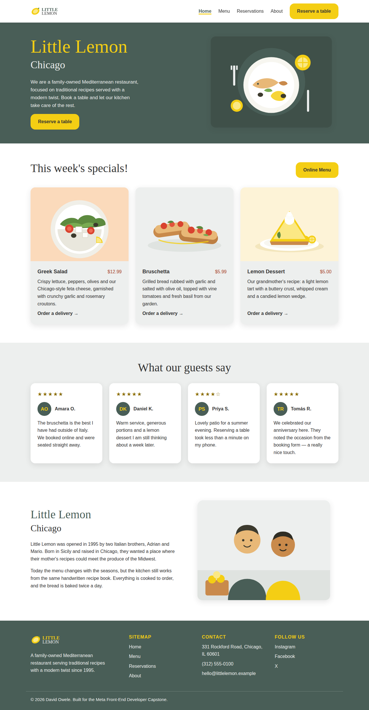
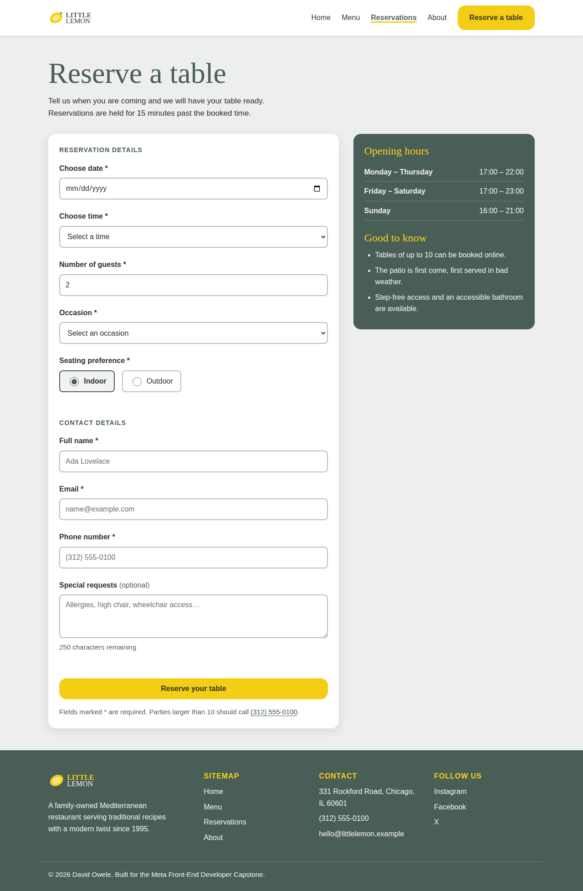
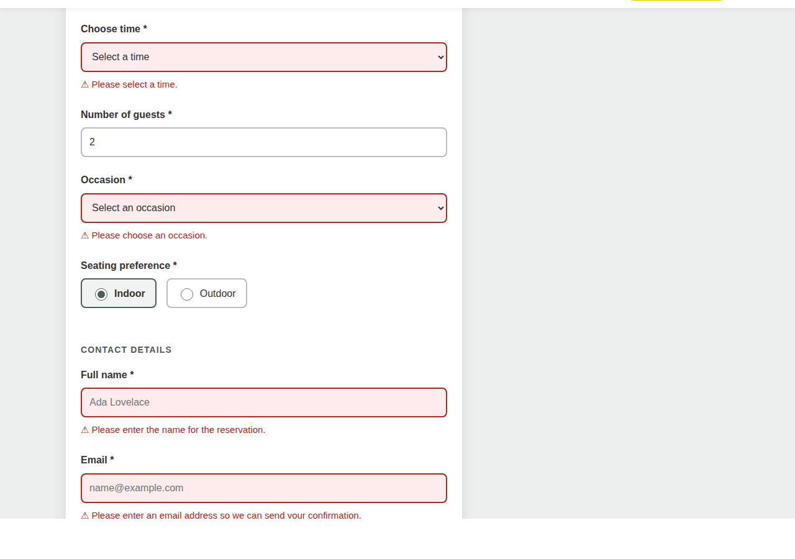
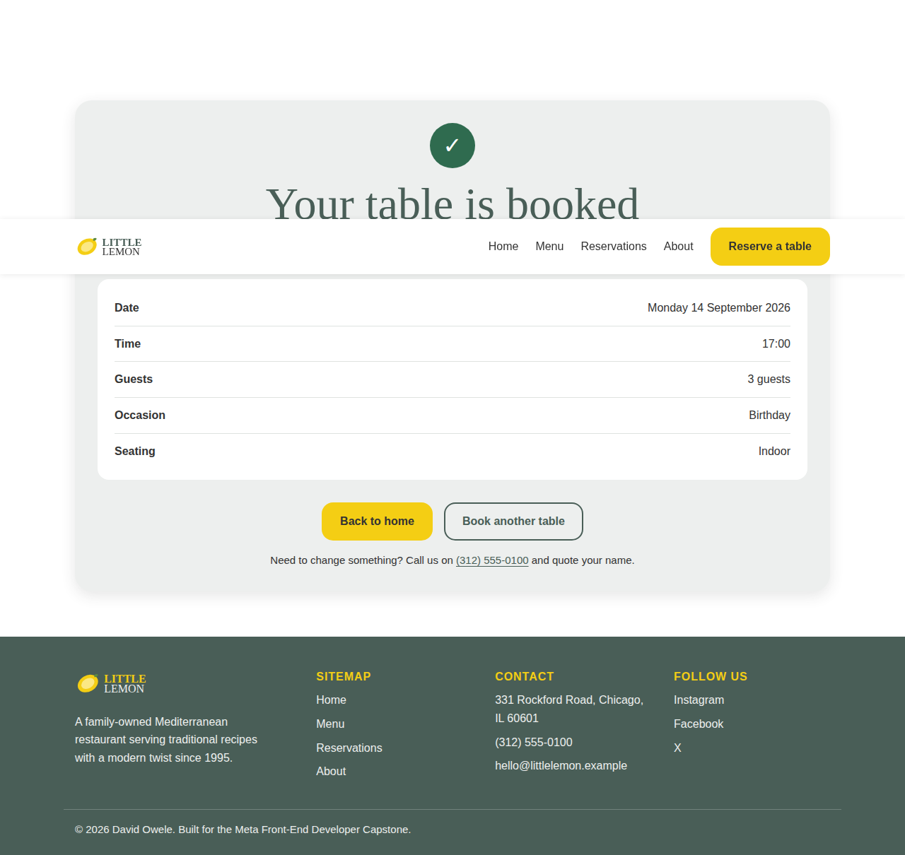
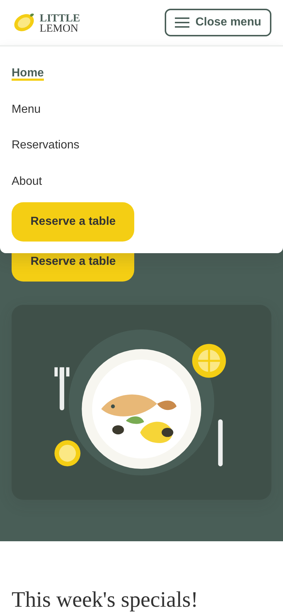

# Little Lemon — Table Booking Web App

A responsive, accessible React web app for the Little Lemon restaurant, built for the
**Meta Front-End Developer Capstone**. Visitors can browse the weekly specials and reserve
a table through a fully validated booking form.



---

## Contents

- [Features](#features)
- [Screenshots](#screenshots)
- [Tech stack](#tech-stack)
- [Getting started](#getting-started)
- [Available scripts](#available-scripts)
- [Running the tests](#running-the-tests)
- [Project structure](#project-structure)
- [How it works](#how-it-works)
  - [State management](#state-management)
  - [Form validation rules](#form-validation-rules)
  - [Edge cases and error handling](#edge-cases-and-error-handling)
  - [Accessibility](#accessibility)
  - [Responsiveness](#responsiveness)
- [Capstone grading criteria](#capstone-grading-criteria)
- [Author](#author)

---

## Features

- **Home page** with hero, weekly specials, customer testimonials and an about section.
- **Reservation form** with nine fields, live per-field validation and an error summary.
- **Date-aware availability** — choosing a date fetches the time slots bookable on that day.
- **Confirmation page** that reads the reservation back to the guest, with the booking also
  saved to `localStorage` so it survives a refresh.
- **Keyboard and screen-reader support** throughout: landmarks, a skip link, labelled fields,
  `aria-invalid` / `aria-describedby` error wiring and a focus-managed error summary.
- **Mobile-first responsive layout** from 320 px upwards, with a disclosure navigation menu.
- **88 unit and integration tests** covering the reducer, the validators, the mock API, the
  form and the full booking journey.

## Screenshots

| Booking form | Validation errors |
| --- | --- |
|  |  |

| Confirmation | Mobile navigation |
| --- | --- |
|  |  |

## Tech stack

| Purpose | Choice |
| --- | --- |
| UI library | React 18 (function components and hooks) |
| Routing | React Router 6 |
| Build tool | Vite 5 |
| Testing | Vitest + React Testing Library + jest-dom |
| Styling | Hand-written CSS with custom properties (no UI framework) |
| Fonts | Markazi Text and Karla, per the Little Lemon style guide |

## Getting started

### Prerequisites

- [Node.js](https://nodejs.org/) 18 or newer (`node -v` to check)
- npm 9 or newer (bundled with Node)

### Installation

```bash
# 1. Clone the repository
git clone https://github.com/<your-username>/little-lemon-booking.git
cd little-lemon-booking

# 2. Install the dependencies
npm install

# 3. Start the development server
npm start
```

The app runs at **http://localhost:5173**. Vite prints the exact URL, and hot-reloads on save.

### Production build

```bash
npm run build     # outputs to dist/
npm run preview   # serves the built app at http://localhost:4173
```

## Available scripts

| Script | What it does |
| --- | --- |
| `npm start` | Start the Vite dev server with hot reloading |
| `npm run dev` | Same as `npm start` |
| `npm run build` | Produce an optimised production build in `dist/` |
| `npm run preview` | Serve the production build locally |
| `npm test` | Run the whole test suite once |
| `npm run test:watch` | Re-run tests as files change |
| `npm run test:coverage` | Run the tests with a coverage report |

## Running the tests

```bash
npm test
```

Expected output:

```
 Test Files  5 passed (5)
      Tests  88 passed (88)
```

What each file covers:

| Test file | Covers |
| --- | --- |
| `src/tests/bookingReducer.test.js` | `initializeTimes` and `updateTimes`: seeding, date changes, determinism, unknown actions |
| `src/tests/validation.test.js` | Every validator, valid and invalid values, plus whole-form validation |
| `src/tests/api.test.js` | `fetchAPI` availability and stability, `submitAPI` accept/reject |
| `src/tests/BookingForm.test.jsx` | Labels, fieldsets, options, live validation, submit payload, API rejection |
| `src/tests/App.test.jsx` | Landmarks, headings, navigation, 404 and redirect routes, end-to-end booking |

## Project structure

```
little-lemon-booking/
├── docs/screenshots/        # Images used by this README
├── public/
│   └── lemon.svg            # Favicon
├── src/
│   ├── assets/
│   │   └── illustrations.jsx    # Inline SVG artwork (dishes, hero, owners)
│   ├── components/
│   │   ├── About.jsx
│   │   ├── BookingForm.jsx      # The reservation form and its validation UI
│   │   ├── Footer.jsx
│   │   ├── Header.jsx
│   │   ├── Hero.jsx
│   │   ├── Logo.jsx
│   │   ├── Nav.jsx              # Responsive navigation with a disclosure menu
│   │   ├── SpecialCard.jsx
│   │   └── Specials.jsx
│   ├── pages/
│   │   ├── BookingPage.jsx      # Wraps the form, talks to the API
│   │   ├── ConfirmedBooking.jsx # Success page
│   │   ├── Home.jsx
│   │   └── NotFound.jsx
│   ├── styles/                  # One stylesheet per area of the site
│   │   ├── booking.css
│   │   ├── footer.css
│   │   ├── header.css
│   │   ├── home.css
│   │   └── index.css            # Design tokens, reset, buttons, utilities
│   ├── tests/                   # Vitest + React Testing Library specs
│   ├── utils/
│   │   ├── api.js               # Mock fetchAPI / submitAPI
│   │   ├── bookingReducer.js    # initializeTimes / updateTimes
│   │   ├── storage.js           # Safe localStorage wrapper
│   │   └── validation.js        # Pure validation functions
│   ├── App.jsx                  # Routes and shared state
│   └── main.jsx                 # Entry point
├── index.html
├── vite.config.js               # Vite + Vitest configuration
└── package.json
```

The guiding rule is **one job per file**: components render, `utils/` holds pure logic, and
`styles/` holds presentation. Because the validation and reducer logic are pure functions in
their own modules, they can be tested without rendering a single component.

## How it works

### State management

The list of bookable times depends on the selected date, so it lives in a `useReducer` store
declared in `App.jsx`:

- `initializeTimes()` seeds the state with today's availability from `fetchAPI`.
- `updateTimes(state, action)` handles `UPDATE_TIMES` (recalculate for a new date),
  `RESET_TIMES`, and returns the state untouched for anything unrecognised.

`BookingForm` dispatches `UPDATE_TIMES` whenever the date changes. Keeping the reducer in
`App` means the reservation state survives navigation to the confirmation page.

`fetchAPI` is seeded from the date, so the same date always offers the same slots — the app
never shuffles times under the visitor, and the tests stay deterministic.

### Form validation rules

| Field | Rules |
| --- | --- |
| Full name | Required, 2–60 characters, letters/spaces/hyphens/apostrophes only |
| Email | Required, must look like `name@example.com` |
| Phone | Required, 7–15 digits, `+`, spaces, dashes and brackets allowed |
| Date | Required, today or later, no more than 12 months ahead |
| Time | Required, must be one of the slots offered for the chosen date |
| Guests | Required, whole number, 1–10 |
| Occasion | Required, one of the listed occasions |
| Seating | Required, Indoor or Outdoor |
| Special requests | Optional, up to 250 characters, with a live character counter |

Validation runs when a field loses focus, then on every keystroke once a field has an error so
the message disappears the moment the value is fixed. On submit the whole form is re-validated.

### Edge cases and error handling

- **Past dates** are blocked twice: the input carries `min={today}` and `validateDate`
  rejects them, so a typed-in date is caught too.
- **Bookings too far ahead** (more than 12 months) are rejected with an explanation.
- **Parties over ten** get the restaurant's phone number instead of a dead end.
- **A stale time slot** — changing the date clears the previously selected time, so a slot that
  is no longer offered can never be submitted.
- **Days with little availability** show a "only N slots left on this date" hint rather than a
  mysteriously short dropdown; `fetchAPI` also guarantees the dropdown is never empty.
- **API rejection** shows a message with a phone number to call, instead of failing silently.
- **`localStorage` unavailable** (private browsing, full quota) is caught and ignored — saving
  the booking history is a convenience and never breaks the booking itself.
- **Unknown URLs** render a 404 page with links back; opening `/confirmed` directly (for
  example after a refresh) redirects to the form rather than showing an empty page.

### Accessibility

- Semantic landmarks: `<header>`, `<nav>`, `<main>`, `<footer>`, `<section>`, `<address>`,
  `<blockquote>`, `<fieldset>`/`<legend>` and description lists for the booking summary.
- A "Skip to main content" link is the first focusable element on the page.
- One `<h1>` per page and a heading order that never skips a level.
- Every input has a real `<label>`; radio buttons are wrapped in a `<fieldset>` with a `<legend>`.
- Invalid fields carry `aria-invalid="true"` and `aria-describedby` pointing at their message.
- The error summary uses `role="alert"` and receives focus on a failed submit.
- The mobile menu button exposes `aria-expanded` / `aria-controls`, and Escape closes the menu.
- Inline SVG artwork uses `role="img"` with an accessible name; decorative graphics are
  `aria-hidden`. Star ratings are also written out as text ("Rated 4 out of 5").
- Errors are never signalled by colour alone — there is always an icon and a text message.
- A single visible focus ring (`:focus-visible`), 48 px minimum touch targets, and
  `prefers-reduced-motion` support.

### Responsiveness

Mobile-first CSS with breakpoints at 600 px, 640 px, 768 px, 900 px, 960 px and 1000 px.
Grids collapse to one column on phones, the navigation becomes a dropdown panel below
768 px, and the layout has been checked for horizontal overflow at 390 px width.

## Capstone grading criteria

| Criterion | Where to look |
| --- | --- |
| UX/UI design and implementation followed | `src/components/`, `src/styles/`, screenshots above |
| Appropriate accessibility tags | [Accessibility](#accessibility); `BookingForm.jsx`, `Nav.jsx`, `illustrations.jsx` |
| Unit tests | `src/tests/` — 88 tests, `npm test` |
| Booking form functional with validation | `BookingForm.jsx`, `utils/validation.js` |
| Correct semantics and responsiveness | Semantic HTML throughout; media queries in `src/styles/` |
| Committed to a Git repository | This repository's commit history |
| Clear, maintainable, commented code | One job per file; every module and non-obvious decision is commented |
| Edge cases and meaningful error messages | [Edge cases and error handling](#edge-cases-and-error-handling) |
| Clear documentation and setup instructions | This README |

## Author

**David Owele** — Meta Front-End Developer Capstone project.

The restaurant, its menu, reviews and address are fictional, and the booking API is mocked
locally; no data leaves the browser.
